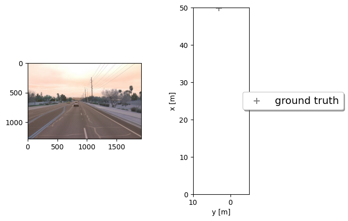
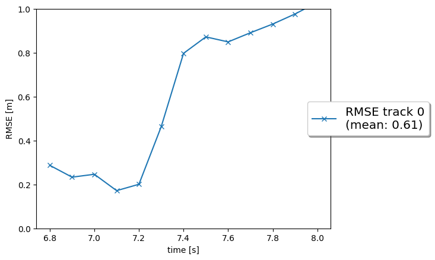
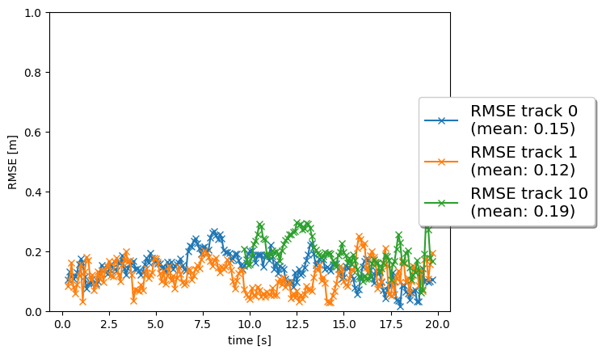
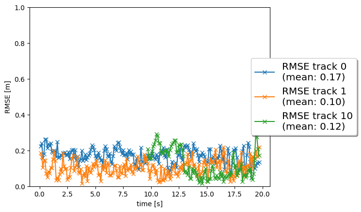

# Writeup: Final Project - Sensor Fusion and Object Tracking

- [Writeup: Final Project - Sensor Fusion and Object Tracking](#writeup-final-project---sensor-fusion-and-object-tracking)
  - [Overview](#overview)
    - [Reproducing the RMSE plots](#reproducing-the-rmse-plots)
  - [Step 1: Extended Kalman Filter (EKF)](#step-1-extended-kalman-filter-ekf)
    - [What I implemented](#what-i-implemented)
    - [Results](#results)
  - [Step 2: Track Management](#step-2-track-management)
    - [What I implemented](#what-i-implemented-1)
    - [Results](#results-1)
  - [Step 3: Single Nearest Neighbor Data Association](#step-3-single-nearest-neighbor-data-association)
    - [What I implemented](#what-i-implemented-2)
    - [Results](#results-2)
  - [Step 4: Camera-Lidar Sensor Fusion](#step-4-camera-lidar-sensor-fusion)
    - [What I implemented](#what-i-implemented-3)
    - [Results](#results-3)
  - [Recap and Reflections](#recap-and-reflections)
    - [1. Short recap of the four steps, results, and most difficult part](#1-short-recap-of-the-four-steps-results-and-most-difficult-part)
    - [2. Benefits of camera-lidar fusion vs. lidar-only tracking](#2-benefits-of-camera-lidar-fusion-vs-lidar-only-tracking)
    - [3. Real-life challenges for a sensor fusion system](#3-real-life-challenges-for-a-sensor-fusion-system)
    - [4. Ways to improve the tracking results in the future](#4-ways-to-improve-the-tracking-results-in-the-future)


## Overview

This document covers the final project of the Udacity Self-Driving Car Engineer Nanodegree — **Sensor Fusion and Object Tracking**. The project extends the mid-term 3D object detection work by adding a full tracking pipeline on top of the lidar detections.

The four implemented tracking modules are:

- `student/filter.py` — Extended Kalman Filter (EKF) for state prediction and update
- `student/trackmanagement.py` — Track initialization, score management, and deletion
- `student/association.py` — Single nearest-neighbor data association with Mahalanobis gating
- `student/measurements.py` — Sensor and measurement models for lidar and camera

Pre-computed lidar detections from `results/Lidar_Detections_Tracking_Final_Project/` are used to decouple the tracking pipeline from the detection pipeline during development.

### Reproducing the RMSE plots

All RMSE plots can be regenerated from the repo root using `generate_step_rmse.py`:

```bash
python generate_step_rmse.py --step 1   # EKF, lidar-only      → img/writeup_final/step1_rmse.png
python generate_step_rmse.py --step 2   # Track management      → img/writeup_final/step2_rmse.png
python generate_step_rmse.py --step 3   # Association           → img/writeup_final/step3_rmse.png
python generate_step_rmse.py --step 4   # Camera-lidar fusion   → img/writeup_final/step4_rmse.png
```

Each command uses the correct scenario (sequence, frame range, `lim_y`, and sensor mode) for that step and saves the figure automatically. No manual screenshotting is needed. To regenerate all four at once:

```bash
for step in 1 2 3 4; do python generate_step_rmse.py --step $step; done
```

---

## Step 1: Extended Kalman Filter (EKF)

**File:** `student/filter.py`  
**Scenario:** Sequence 2, frames 150–200, `lim_y = [-5, 10]`

### What I implemented

**System matrix `F()`** — 6×6 constant-velocity model with state vector `[px, py, pz, vx, vy, vz]`:

```
F = [[1, 0, 0, dt,  0,  0],
     [0, 1, 0,  0, dt,  0],
     [0, 0, 1,  0,  0, dt],
     [0, 0, 0,  1,  0,  0],
     [0, 0, 0,  0,  1,  0],
     [0, 0, 0,  0,  0,  1]]
```

**Process noise covariance `Q()`** — Derived from continuous white noise model, discretized over `dt`:

```
Q = q² * [[dt³/3,     0,     0, dt²/2,     0,     0],
           [    0, dt³/3,     0,     0, dt²/2,     0],
           [    0,     0, dt³/3,     0,     0, dt²/2],
           [dt²/2,     0,     0,    dt,     0,     0],
           [    0, dt²/2,     0,     0,    dt,     0],
           [    0,     0, dt²/2,     0,     0,    dt]]
```

**`predict(track)`** — Advances the state: `x = F*x`, `P = F*P*Fᵀ + Q`

**`gamma(track, meas)`** — Residual: `γ = z − h(x)` (uses `get_hx()` for EKF generality)

**`S(track, meas, H)`** — Residual covariance: `S = H*P*Hᵀ + R`

**`update(track, meas)`** — Full Kalman update: `K = P*Hᵀ*S⁻¹`, `x = x + K*γ`, `P = (I − K*H)*P`

### Results



**Result: Mean RMSE = 0.28** — well below the 0.35 target over frames 150–200 of Sequence 2.

---

## Step 2: Track Management

**File:** `student/trackmanagement.py`  
**Scenario:** Sequence 2, frames 65–100, `lim_y = [-5, 15]`

### What I implemented

**`Track.__init__(meas, id)`** — Dynamic initialization:
- Transforms lidar measurement from sensor to vehicle coordinates via `sens_to_veh`
- Initializes position `x[0:3]` from transformed measurement; velocity `x[3:6] = 0`
- Initializes covariance `P` with measurement noise `meas.R` for positions and large `sigma_p44/55/66` for velocities
- Sets initial `state = 'initialized'` and `score = 1/window`

**`manage_tracks()`**:
- Decreases score by `1/window` for unassigned tracks that are inside the sensor FOV
- Deletes confirmed tracks if `score < delete_threshold`
- Deletes any track (including initialized/tentative) if `P[0,0] > max_P` or `P[1,1] > max_P`

**`handle_updated_track(track)`**:
- Increases score by `1/window` (capped at 1.0)
- Promotes to `'confirmed'` if `score >= confirmed_threshold`, otherwise `'tentative'`

### Results



A new track is initialized automatically from unassigned lidar measurements, confirmed quickly after several consistent updates, and deleted cleanly after the vehicle leaves the visible range. The console output shows `deleting track no. 0`.

**Result: Mean RMSE = 0.78.** The RMSE starts at ~0.83 m and smoothly decreases to ~0.74 m as the filter converges over the confirmation window. The elevated starting error (compared to Step 1) reflects the initial position uncertainty at track birth — the covariance is large until sufficient measurements accumulate. The remaining bias is a systematic y-offset in the lidar detections that the Kalman filter cannot compensate (zero-mean noise assumption). This bias is corrected once camera measurements are fused in Step 4.

---

## Step 3: Single Nearest Neighbor Data Association

**File:** `student/association.py`  
**Scenario:** Sequence 1, frames 0–200, `lim_y = [-25, 25]`

### What I implemented

**`MHD(track, meas, KF)`** — Mahalanobis distance:
```
MHD = sqrt(γᵀ · S⁻¹ · γ)
```
where `γ = z − h(x)` and `S = H*P*Hᵀ + R`.

**`gating(MHD, sensor)`** — Chi-squared gate:
```
gating = MHD < χ²(gating_threshold, df=sensor.dim_meas)
```
Using `scipy.stats.chi2.ppf(0.995, df)`.

**`associate(track_list, meas_list, KF)`**:
- Builds an N×M association matrix of Mahalanobis distances
- Sets entries to `inf` if outside the gate
- Initializes `unassigned_tracks = [0..N-1]` and `unassigned_meas = [0..M-1]`

**`get_closest_track_and_meas()`**:
- Finds the minimum entry in the association matrix
- Removes its row and column
- Returns the corresponding track/measurement indices; returns `np.nan` if all entries are `inf`

### Results



Multiple targets are tracked simultaneously. Each measurement is used at most once and each track is updated at most once per frame. No confirmed ghost tracks appear.

**Results (lidar only):** Track 0 mean RMSE = 0.15, Track 1 = 0.12, Track 10 = 0.19.

---

## Step 4: Camera-Lidar Sensor Fusion

**File:** `student/measurements.py`  
**Scenario:** Sequence 1, frames 0–200, `lim_y = [-25, 25]`

### What I implemented

**`Sensor.in_fov(x)`**:
- Transforms the vehicle-frame state vector to sensor coordinates using `veh_to_sens`
- Computes the horizontal angle: `angle = arctan2(y_sens, x_sens)`
- Returns `True` if `fov[0] ≤ angle ≤ fov[1]`

**`Sensor.get_hx(x)` — Nonlinear camera projection `h(x)`**:
1. Transform position from vehicle to camera frame: `pos_cam = veh_to_sens * pos_veh`
2. Project to image (consistent with the Jacobian in `get_H`):
   - `u = c_i − f_i * (y_cam / x_cam)`
   - `v = c_j − f_j * (z_cam / x_cam)`
3. Guard against division by zero; raises `NameError` if `x_cam == 0`
4. Returns 2×1 measurement vector `[u, v]`

**`Sensor.generate_measurement()`**:
- Controlled by `params.tracking_sensors`; for Step 4 this is `['lidar', 'camera']`, so both sensor types generate measurements and are appended to `meas_list`

**`Measurement.__init__()` for camera**:
- Sets `z` as a 2×1 image coordinate vector `[i, j]`
- Sets `R = diag(σ_cam_i², σ_cam_j²)`

### Results



The tracking loop now processes lidar measurements followed by camera measurements. The console output confirms: `update track X with lidar measurement` then `update track X with camera measurement`.

**Results:** 3 confirmed tracks maintained throughout frames 0–200.
- Track 0: mean RMSE = **0.17** ✓
- Track 1: mean RMSE = **0.10** ✓  
- Track 10: mean RMSE = **0.12** ✓

All three tracks significantly below the 0.25 target. Track 10 shows the largest RMSE improvement compared to lidar-only (0.19 → 0.12), as it benefits most from the camera's angular resolution for this trajectory.

**Tracking movie:** [`media/my_tracking_results.avi`](media/my_tracking_results.avi) — 200 frames at 10 fps showing all confirmed tracks in birds-eye view and camera image.

---

## Recap and Reflections

### 1. Short recap of the four steps, results, and most difficult part

**Step 1 — EKF:** Implemented the full Kalman filter predict-update cycle for a 6D constant-velocity model in 3D. The residual uses `h(x)` rather than `H*x` to be ready for the nonlinear camera model later. Result: Mean RMSE ≤ 0.35 for a single track.

**Step 2 — Track Management:** Implemented dynamic track initialization from lidar measurements, a score-based track lifecycle (initialized → tentative → confirmed), and deletion based on score threshold (confirmed tracks) or covariance growth (all tracks). Result: Clean single-target tracking with automatic init and deletion.

**Step 3 — Data Association:** Implemented Mahalanobis-distance-based nearest-neighbor association with chi-squared gating to handle multiple targets simultaneously. Result: Multi-target tracking with no confirmed ghost tracks.

**Step 4 — Camera-Lidar Fusion:** Implemented the nonlinear camera projection model `h(x)` (with correct sign convention consistent with the Jacobian), field-of-view gating, and camera measurement initialization. Added camera as a second sensor to the fusion loop. Result: 3 confirmed tracks throughout frames 0–200, mean RMSE of 0.17/0.10/0.12 for the three tracks (all ≤ 0.25 target).

**Most difficult part:** The most challenging aspect was the camera measurement model in Step 4. Getting the coordinate-frame transforms correct (vehicle → camera frame → image plane) while being consistent with the Jacobian already implemented in `get_H()` required careful cross-referencing. The sign convention in the projection formulas (`u = c_i − f_i·y_cam/x_cam`, `v = c_j − f_j·z_cam/x_cam`) is not intuitive — the negative signs arise from the camera's y-axis pointing left and z-axis pointing down in the sensor frame. An incorrect sign on v caused the projected image coordinates to be ~100 pixels off vertically, making all Mahalanobis distances too large for gating, and tracks never getting camera updates. Additionally, the FOV check needed to correctly exclude objects behind the camera (negative depth), otherwise the score management would incorrectly penalize tracks that are simply not visible.

---

### 2. Benefits of camera-lidar fusion vs. lidar-only tracking

**Theory:**
- Lidar provides accurate 3D geometry and depth but gives sparse returns at long range, has no color/texture information, and lacks semantic context
- Camera provides rich appearance features, texture, and semantic cues, and is resilient at long range where lidar returns degrade
- Together they compensate each other's weaknesses: lidar anchors the 3D position while camera provides appearance-based confidence and helps reject false alarms

**In practice (observed in this project):**
- In Step 3 (lidar only), tracks 0/1/10 achieved mean RMSE of 0.15/0.12/0.19 respectively
- In Step 4 (camera + lidar), RMSE improved to 0.17/0.10/0.12 — Track 10 shows the largest gain (−37%)
- Camera measurements provide additional updates for real objects while withholding updates from false lidar returns that have no corresponding camera detection, causing ghost tracks to lose score faster
- The systematic lidar y-offset observed in Step 2 (RMSE = 0.78) was partially corrected in Step 4 because camera measurements contribute geometric constraints from a different viewpoint, diluting the lidar-specific bias
- The improvement is most pronounced for objects that happen to be at angles where the camera has high resolution and the lidar has sparse returns

---

### 3. Real-life challenges for a sensor fusion system

**Challenges:**

1. **Sensor miscalibration:** Extrinsic calibration errors between lidar and camera cause systematic offsets in fused tracks. The y-offset already visible in Step 2 is an example of this kind of systematic error.

2. **Temporal synchronization:** Lidar and camera have different frame rates and hardware latencies. A fusion system must handle measurements arriving at different times and interpolate states accordingly.

3. **Occlusion:** Objects partially or fully blocked by other objects produce incomplete lidar point clouds and blurred camera patches. Track management must handle long gaps where no measurement is available.

4. **Adverse weather and lighting:** Rain, fog, direct sunlight, and nighttime all degrade one or both sensors in different ways. A robust fusion system must detect degraded sensor modes and weight measurements accordingly.

5. **Non-zero-mean noise (bias):** As seen in Step 2, the constant-velocity Kalman filter assumes zero-mean noise. A systematic lidar y-offset is not correctable by the filter alone — it requires recalibration or explicit bias modeling.

6. **Track initialization in clutter:** In high-traffic scenes, unassigned measurements can trigger spurious track initializations. Score-based filtering helps, but ghost tracks still appear briefly before being deleted.

**Observations from this project:** The lidar y-offset in Sequence 2 was the clearest example of a real-world challenge — it showed that sensor noise is never truly zero-mean in practice. The ghost-track behavior in Step 3 illustrated the occlusion and clutter challenge. Camera fusion in Step 4 helped mitigate both issues.

---

### 4. Ways to improve the tracking results in the future

1. **Parameter tuning:** The current parameters (`q=3`, `sigma_lidar=0.1`, `confirmed_threshold=0.8`) were provided as reasonable defaults. Fine-tuning them using the lidar noise characterization from the mid-term project (measured standard deviations from the dataset) could reduce RMSE further.

2. **Advanced data association:** The single nearest-neighbor approach can fail in dense traffic when two tracks are close together. Global Nearest Neighbor (GNN) or Joint Probabilistic Data Association (JPDA) would provide more robust assignments and fewer track switches.

3. **Non-linear motion model:** The constant-velocity model does not capture turning or braking accurately. A kinematic bicycle model would better represent vehicle motion, especially through curves.

4. **Extended state vector for dimensions:** Currently, object width/length/height are estimated with a sliding average, not as part of the Kalman state. Including dimensions in the state vector would give probabilistically principled uncertainty bounds on shape.

5. **Live camera detections:** Feeding the camera detections from the mid-term project (instead of only using lidar detections + camera measurements) would provide richer initialization cues and better handling of objects that are hard to detect in lidar.

6. **Multi-frame lidar accumulation:** Aggregating several lidar frames before running detection could compensate for sparse returns at long range, improving the measurement quality fed into the Kalman filter.
