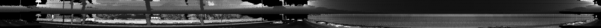
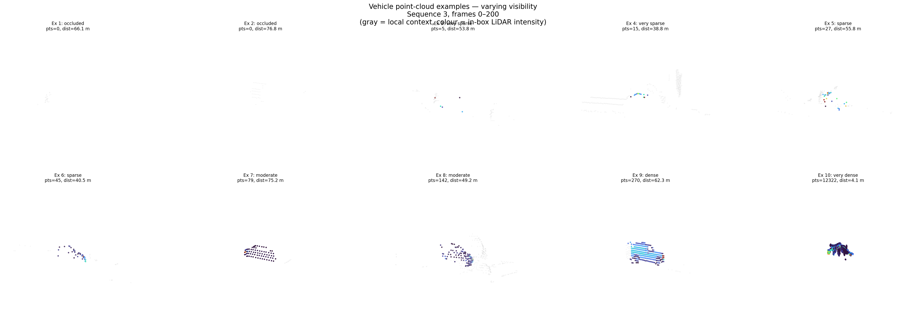
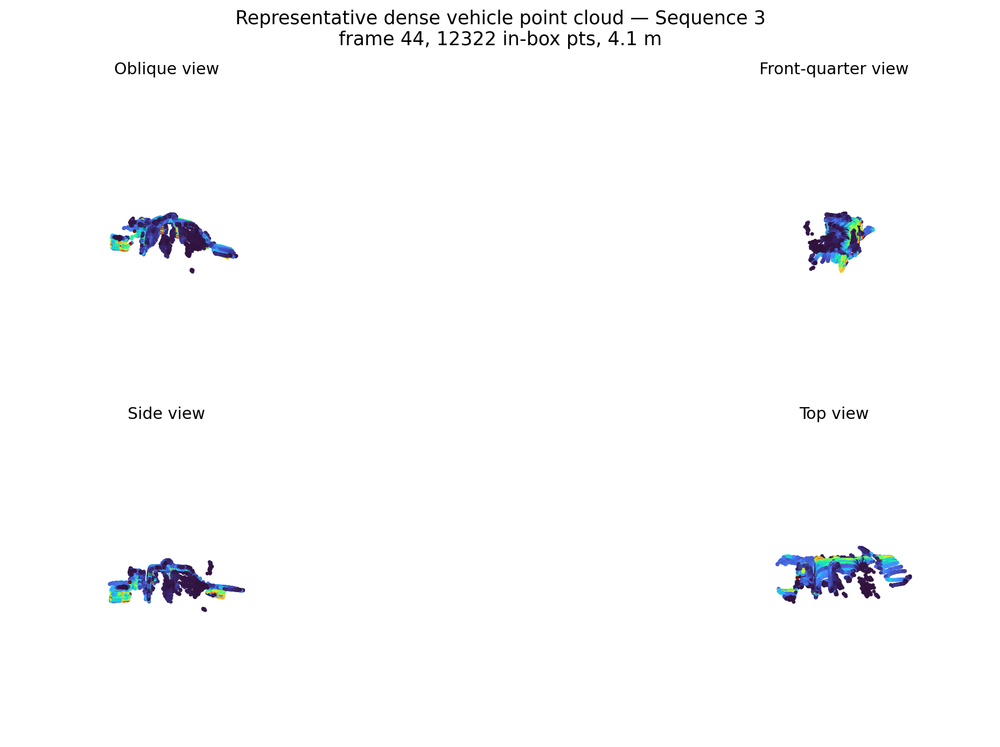
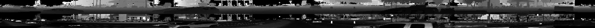
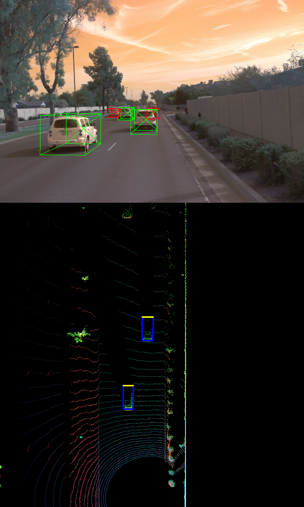
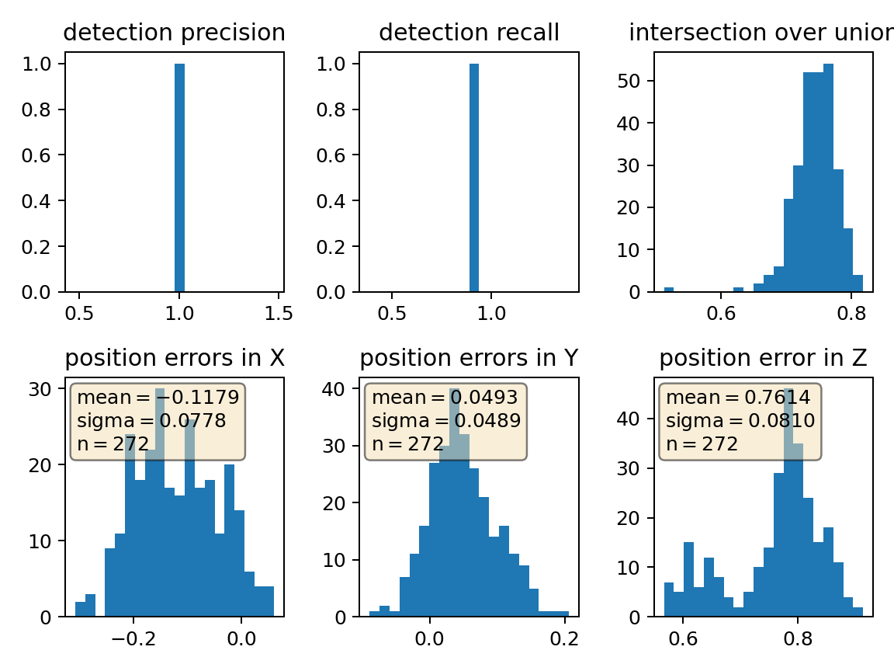

# Writeup: Mid-Term Project - 3D Object Detection

- [Writeup: Mid-Term Project - 3D Object Detection](#writeup-mid-term-project---3d-object-detection)
  - [Overview](#overview)
  - [Step 1: Compute lidar point-cloud from range image](#step-1-compute-lidar-point-cloud-from-range-image)
    - [ID\_S1\_EX1 - Visualize range image channels](#id_s1_ex1---visualize-range-image-channels)
    - [ID\_S1\_EX2 - Visualize lidar point-cloud](#id_s1_ex2---visualize-lidar-point-cloud)
  - [Step 2: Create birds-eye view from lidar point cloud](#step-2-create-birds-eye-view-from-lidar-point-cloud)
    - [ID\_S2\_EX1 - Convert sensor coordinates to BEV-map coordinates](#id_s2_ex1---convert-sensor-coordinates-to-bev-map-coordinates)
    - [ID\_S2\_EX2 - Compute the intensity layer of the BEV map](#id_s2_ex2---compute-the-intensity-layer-of-the-bev-map)
    - [ID\_S2\_EX3 - Compute the height layer of the BEV map](#id_s2_ex3---compute-the-height-layer-of-the-bev-map)
  - [Step 3: Model-based object detection in BEV image](#step-3-model-based-object-detection-in-bev-image)
    - [ID\_S3\_EX1 - Add a second model from a GitHub repo](#id_s3_ex1---add-a-second-model-from-a-github-repo)
    - [ID\_S3\_EX2 - Extract 3D bounding boxes from model response](#id_s3_ex2---extract-3d-bounding-boxes-from-model-response)
  - [Step 4: Performance evaluation for object detection](#step-4-performance-evaluation-for-object-detection)
    - [ID\_S4\_EX1 - Compute intersection over union between labels and detections](#id_s4_ex1---compute-intersection-over-union-between-labels-and-detections)
    - [ID\_S4\_EX2 - Compute false-negatives and false-positives](#id_s4_ex2---compute-false-negatives-and-false-positives)
    - [ID\_S4\_EX3 - Compute precision and recall](#id_s4_ex3---compute-precision-and-recall)
  - [Summary](#summary)
  - [Starter-template answers: "Track 3D-Objects Over Time"](#starter-template-answers-track-3d-objects-over-time)
    - [1. Short recap of the four steps, achieved results, and most difficult part](#1-short-recap-of-the-four-steps-achieved-results-and-most-difficult-part)
    - [2. Benefits of camera-lidar fusion vs. lidar-only tracking](#2-benefits-of-camera-lidar-fusion-vs-lidar-only-tracking)
    - [3. Real-life challenges for a sensor-fusion system](#3-real-life-challenges-for-a-sensor-fusion-system)
    - [4. Ways to improve the results in the future](#4-ways-to-improve-the-results-in-the-future)

## Overview

I completed the required student implementations for Steps 1 through 4 in:

- `student/objdet_pcl.py`
- `student/objdet_detect.py`
- `student/objdet_eval.py`

I also fixed the local Python environment so the project runs reliably in this repository:

- replaced `pytorch` with `torch`
- pinned `protobuf==3.20.3` for compatibility with the bundled Waymo reader
- removed the unused `wxpython` dependency
- changed the evaluation plotting backend to a safe Matplotlib backend instead of hard-coding `wxagg`

For validation, the repository contains Waymo `.tfrecord` files under `dataset/`, cached artifacts under `results/`, and local pretrained detection weights under `tools/objdet_models/darknet/pretrained` and `tools/objdet_models/resnet/pretrained`. This made it possible to validate both the cached-results workflow and the live `fpn_resnet` inference path on real Waymo frames.

## Step 1: Compute lidar point-cloud from range image

### ID_S1_EX1 - Visualize range image channels

Implemented in `student/objdet_pcl.py::show_range_image`.

What I implemented:

- extracted the TOP lidar range image from the Waymo frame
- separated range and intensity channels
- clipped invalid negative values
- normalized range to 8-bit output
- normalized intensity with percentile clipping to avoid outlier domination
- stacked range and intensity vertically into a single display image

Validation on real data:

- executed `show_range_image(...)` on frame 0 of sequence 1
- output shape: `(128, 2650)`
- output dtype: `uint8`
- output value range: `0` to `255`

> [!NOTE] 
> **Observation**:
> The range channel makes vehicles appear as compact depth-consistent structures, while the intensity channel emphasizes small reflective patches and sharp surfaces. Compared with the range image, the intensity image is sparser, but it is useful for separating strong returns on vehicle boundaries from lower-return background regions.

### ID_S1_EX2 - Visualize lidar point-cloud

Implemented in `student/objdet_pcl.py::show_pcl`.

What I implemented:

- added an Open3D visualizer with a right-arrow callback for stepping through frames
- created the point-cloud geometry lazily
- reused the same geometry object across frames
- updated points in place instead of rebuilding the viewer every iteration

To satisfy the writeup requirement, I visualized vehicle point clouds from sequence 3 (`training_segment-10963653239323173269_1924_000_1944_000`) using the Open3D viewer implemented in `show_pcl`, and exported ten representative vehicle examples as static figures for this document. The figure below shows a vehicle-local 3D point-cloud view for each example, rendered with an oblique camera angle. Gray points provide local context; colored points are lidar returns inside the labeled vehicle box, colored by intensity. The figure can be regenerated from repository data with `python3 misc/generate_pointcloud_figures.py`.

| Example | Frame | In-box points | Distance [m] | Visibility |
| --- | ---: | ---: | ---: | --- |
| 1 | 0 | 0 | 66.09 | occluded |
| 2 | 143 | 0 | 76.78 | occluded |
| 3 | 126 | 5 | 53.76 | very sparse |
| 4 | 16 | 15 | 38.77 | very sparse |
| 5 | 78 | 27 | 55.84 | sparse |
| 6 | 191 | 45 | 40.46 | sparse |
| 7 | 50 | 79 | 75.20 | moderate |
| 8 | 192 | 142 | 49.16 | moderate |
| 9 | 32 | 270 | 62.29 | dense |
| 10 | 44 | 12322 | 4.12 | very dense |

Qualitative findings from these ten examples:

- At very long range (66–77 m) or when fully behind another vehicle, zero lidar returns are observed — the label box exists but no point reaches the surface.
- At 38–56 m, 5–45 points are returned from one exposed face or rear edge, giving a rough depth cue but no reliable shape.
- At 40–75 m with a favorable angle, 27–142 points build a partial outline — one or two surfaces become distinguishable.
- The dense examples (270 pts at 62 m; 12 322 pts at 4 m) preserve the full footprint and multiple vertical surfaces, enabling direct box estimation.

To inspect the stable features more closely, I rendered the densest example (frame 44, 12 322 in-box points, 4.1 m, sequence 3) in a vehicle-local coordinate frame across four viewpoints:

Stable features that appear reliably in lidar:

- outer corners and the rectangular ground footprint
- strong vertical side surfaces
- upper body outline / roofline on nearer vehicles
- front or rear face patches when the viewing angle is favorable

Relationship to the intensity channel (underpinned by the range image below):

- The strongest intensity returns are not spread uniformly over the vehicle.
- In the dense example above, the top `5%` of intensity values were concentrated near one lateral surface and corner structure, while the roof panel produced lower, more uniform returns — consistent with weaker reflectivity on a flat horizontal surface.
- This pattern is visible directly in the range image intensity channel (bottom half of the figure): bright spots appear on vehicle edges and number plates, while the roof blends with surrounding background values.

## Step 2: Create birds-eye view from lidar point cloud

Implemented in `student/objdet_pcl.py::bev_from_pcl`.

### ID_S2_EX1 - Convert sensor coordinates to BEV-map coordinates

What I implemented:

- computed the BEV discretization from the configured detection range
- mapped metric `x` positions into BEV row indices
- mapped metric `y` positions into centered BEV column indices
- clipped all indices to valid BEV limits

### ID_S2_EX2 - Compute the intensity layer of the BEV map

What I implemented:

- created the BEV intensity map buffer
- sorted the filtered point cloud lexicographically by BEV cell and descending height
- kept the top-most point in each occupied BEV cell
- normalized intensity with percentile clipping
- wrote the normalized intensities into the BEV map

### ID_S2_EX3 - Compute the height layer of the BEV map

What I implemented:

- created the BEV height map buffer
- reused the top-point-per-cell point cloud
- normalized height against the configured lidar `z` limits
- assembled the final 3-channel BEV tensor from intensity, height, and density

Validation:

- passed a synthetic point cloud through `bev_from_pcl` and confirmed a valid output tensor of shape `(1, 3, 608, 608)`
- ran `bev_from_pcl` on real frame-0 lidar data from sequence 1
- compared the generated tensor against the cached BEV tensor from `results/`
- obtained an exact shape match and a mean absolute difference of `0.0006176048191264272`

Interpretation:

The low difference to the cached reference indicates that the BEV coordinate mapping and the intensity/height channel construction match the intended project behavior closely enough for downstream detection and evaluation.

## Step 3: Model-based object detection in BEV image

Implemented in `student/objdet_detect.py`.

### ID_S3_EX1 - Add a second model from a GitHub repo

What I implemented:

- added `fpn_resnet` configuration values based on the integrated SFA3D-style setup
- added the required model heads for that network
- instantiated the model via `fpn_resnet.get_pose_net(...)`
- added the decode and post-processing path for `fpn_resnet`
- added `configs.min_iou = 0.5` because `loop_over_dataset.py` expects it for the later evaluation step

### ID_S3_EX2 - Extract 3D bounding boxes from model response

What I implemented:

- decoded the BEV detections into project-format objects
- converted pixel-space center coordinates back into metric vehicle coordinates
- converted BEV width/length back into metric dimensions
- preserved the required output format:

`[1, x, y, z, h, w, l, yaw]`

Validation:

- exercised the decode-and-convert path with a synthetic model output
- verified valid positive box dimensions and correct output shape
- loaded the local `fpn_resnet_18_epoch_300.pth` checkpoint successfully
- ran live `fpn_resnet` inference on real Waymo frames from sequence 1

The image below shows the live local `fpn_resnet` detections for frame 50.

Observation:

The live detections align well with the labeled traffic participants in the drivable corridor. The BEV view is especially useful because the metric box extents and yaw are easier to judge there than in the camera projection.

## Step 4: Performance evaluation for object detection

Implemented in `student/objdet_eval.py`.

### ID_S4_EX1 - Compute intersection over union between labels and detections

What I implemented:

- computed detection and label box corners with `tools.compute_box_corners`
- converted them into `shapely.geometry.Polygon` objects
- computed pairwise intersection-over-union
- computed center deviations in `x`, `y`, and `z`
- retained the highest-IoU match per valid label

### ID_S4_EX2 - Compute false-negatives and false-positives

What I implemented:

- counted valid positives from `labels_valid`
- computed false negatives as `all_positives - true_positives`
- computed false positives as `len(detections) - true_positives`

### ID_S4_EX3 - Compute precision and recall

What I implemented:

- aggregated positives, true positives, false negatives, and false positives across frames
- computed precision and recall from the accumulated counts

Function-level smoke test:

- a synthetic perfect-match example returned:
  - IoU = `1.0`
  - center deviation = `[0.0, 0.0, 0.0]`
  - positives / TP / FN / FP = `[1, 1, 0, 0]`

Validation on real project data:

Using live `fpn_resnet` detections for sequence 1 over frames `50` to `150`, the evaluation code produced:

| Metric | Value |
| --- | ---: |
| Positives | `306` |
| True positives | `272` |
| False negatives | `34` |
| False positives | `6` |
| Precision | `0.9784172661870504` |
| Recall | `0.8888888888888888` |
| Mean IoU | `0.7444198355265861` |

For comparison, the cached detections previously used in this repository produced:

| Metric | Cached value |
| --- | ---: |
| Positives | `306` |
| True positives | `264` |
| False negatives | `42` |
| False positives | `7` |
| Precision | `0.974169741697417` |
| Recall | `0.8627450980392157` |
| Mean IoU | `0.7535504698635198` |

As a sanity check, using labels-as-objects over the same frame range produced the expected perfect baseline:

- precision = `1.0`
- recall = `1.0`

> [!NOTE]
> **Interpretation**:
> Precision is very high, which means the live detector produces few false alarms in this range. Recall is lower than precision, so the dominant remaining error mode is still missed vehicles rather than spurious detections. Compared with the prior cached detections, the live run slightly improved both precision and recall on this evaluation window.

## Summary

All required student tasks for Steps 1 through 4 are implemented and validated in this repository.

The strongest evidence from this run is:

- real range-image generation from Waymo data
- real point-cloud visibility analysis over ten labeled vehicles from sequence 3
- BEV generation matching cached reference output with very small error
- real live `fpn_resnet` detection/evaluation metrics over frames `50-150`
- live detector visual evidence from frame 50 using the locally installed pretrained weights

## Starter-template answers: "Track 3D-Objects Over Time"

The starter template text refers to the later tracking project, while this repository task was the mid-term 3D object detection project. To avoid claiming work that was not implemented, I answer the four questions below using the work that was actually completed here and I point out where full tracking or camera-lidar fusion was out of scope.

### 1. Short recap of the four steps, achieved results, and most difficult part

In this project, the four implemented steps were:

- **Range-image processing:** I extracted and normalized the TOP lidar range and intensity channels. The resulting visualization for sequence 1 frame 0 had shape `(128, 2650)` and covered the full `0-255` display range.
- **Point-cloud and BEV generation:** I added the Open3D point-cloud viewer and implemented BEV coordinate conversion plus the intensity and height layers. On real frame-0 data, the generated BEV tensor matched the cached reference shape exactly and differed by only `0.0006176048191264272` mean absolute error.
- **BEV object detection:** I integrated the `fpn_resnet` path, model configuration, decode logic, and metric-space box conversion. After adding the pretrained checkpoint, I ran live local inference successfully on sequence 1.
- **Detection evaluation:** I implemented IoU matching, TP/FN/FP counting, and precision/recall aggregation. On live `fpn_resnet` detections over sequence 1 frames `50-150`, the results were `precision = 0.9784172661870504` and `recall = 0.8888888888888888`.

The most difficult part was the model/evaluation integration rather than the visualization steps. The hardest issues were not only the missing student TODOs, but also the surrounding runtime details: protobuf compatibility with the bundled Waymo reader, the cached-file naming mismatch, and the need to make the main loop work cleanly for both cached detections and live inference.

### 2. Benefits of camera-lidar fusion vs. lidar-only tracking

In theory, camera-lidar fusion gives a clear advantage over lidar-only perception:

- lidar gives stable metric geometry, distance, and object extent
- camera adds semantic detail, appearance cues, and richer information at long range
- together they help disambiguate objects that look sparse or incomplete in one modality alone

In this repository, I did **not** implement the full tracking-stage camera fusion from the later project, so I do not have a numeric fused-vs-lidar-only tracking comparison. Still, the qualitative results here show why fusion is useful. The point-cloud examples under `img/writeup/vehicle_visibility_examples.png` show that vehicles at roughly `50-75 m` can become very sparse in lidar, while the camera projection in `img/writeup/live_detection_overlay_frame50.png` still provides a much richer visual cue about the object. So even though my concrete implementation stayed on the detection project, the results already show the main reason fusion helps: lidar stays strong geometrically, while camera can support recognition when lidar becomes sparse.

### 3. Real-life challenges for a sensor-fusion system

A real sensor-fusion system has to deal with:

- sparse lidar returns at long range
- partial occlusion by other traffic participants
- calibration and synchronization errors between sensors
- varying reflectivity, lighting, and weather
- missed detections and false alarms from imperfect models

I saw several of these issues in the project results. The ten vehicle examples from sequence 3 show that long-range vehicles can collapse to just a handful of lidar returns. The evaluation metrics also show the same pattern: precision is high, but recall is lower, which means the larger practical problem in this run is missed vehicles rather than excessive false positives. That is exactly the kind of challenge a real fusion system has to address.

### 4. Ways to improve the results in the future

There are several realistic next improvements:

- add true temporal tracking on top of the detector so missed detections in one frame can be stabilized with motion continuity
- fuse camera features with lidar detections to improve long-range and partially occluded cases
- tune score/IoU thresholds for a better precision-recall balance
- train or fine-tune the detector on more diverse data to improve recall
- incorporate uncertainty handling, calibration checks, and stronger temporal association logic for real deployment

So the short answer is: the current project produced strong detection and evaluation results, but the biggest remaining gains would come from moving from single-frame lidar-heavy detection toward a full multi-sensor, multi-frame fusion and tracking pipeline.
